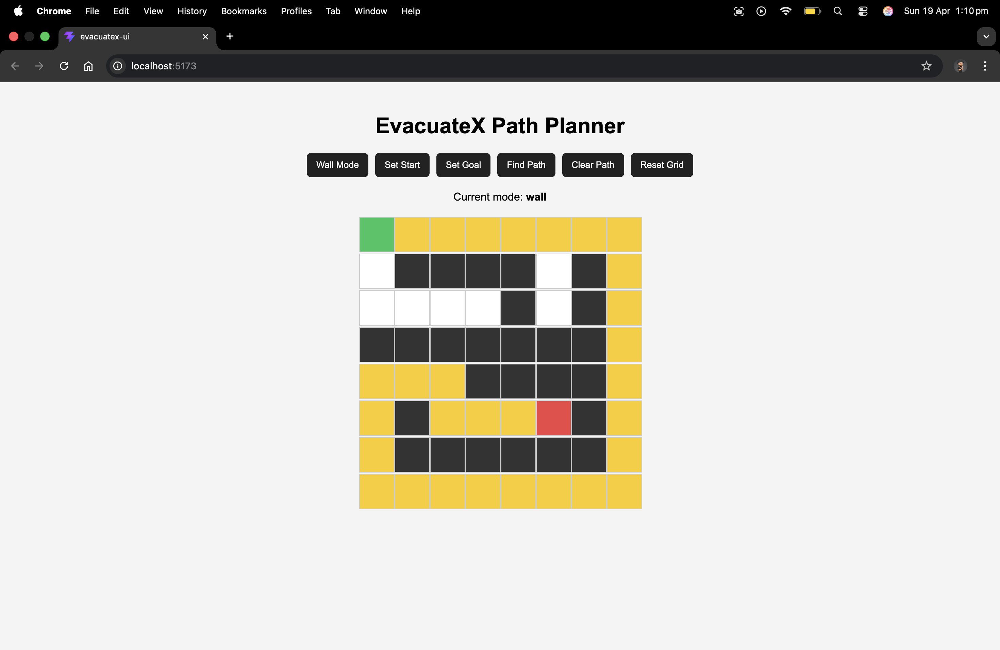

# 🚀 EvacuateX — Path Planning Evacuation Visualizer
An interactive path planning application that demonstrates real-time pathfinding using a native C++ core engine with a web-based interface. This will be developed further to use a mapped blurprint instead of the simple grid displayed.

Developed this project as a result of applying algorithm concepts and to understand cross language interoperability better as well as demonstrate .NET skills and learn throughout the process as well.

## 🧠 Overview
- Uses a multi-layer architecture.
   - C++ pathfinding algorithm
   - ASP.NET Core for API creation
   - React (Vite) for frontend
- Cross-language interoperability (C# <-> C++)
- In-development project, blueprint visualization to be implemented.
- Memory management between managed and unmanaged code.

## ⚙️ Tech Stack
- C++ - A* pathfinding engine
- CMake - Native building environment
- ASP.NET Core (.NET) - Backend API
- React + Vite - UI
- JavaScript (Fetch API) - Client Server communication

## ✨ Features

- Interactive grid-based environment
- A* pathfinding algorithm
- Wall/obstacle placement
- Start and goal positioning
- Click and drag wall drawing
- Animated path visualization
- Real-time API integration

## 📂 Folder structure (Present)

backend/  
└─── EvacuateX.Api/  
└─── NativeInterop/ - EvacuateX.Native/

frontend/  
└─── evacuatex-ui/

## 💻 Prerequisites
Install all below (update if required),
- Node.js environment
- .NET SDK (v10)
- CMake
- C++ Compiler
   - macOS - Xcode Command Line Tools (clang) (home brew installation easier)
   - Linux - gcc / clang

## ▶️ Installation and Local Deployment

Clone repo from github accordingly.

### 1. Build Native C++ Library
- cd backend/NativeInterop/EvacuateX.Native
- cmake -S . -B build
- cmake --build build

### 2. Start Backend API
- cd backend/EvacuateX.Api
- export DYLD_LIBRARY_PATH="$(pwd)/../NativeInterop/EvacuateX.Native/build:$DYLD_LIBRARY_PATH"
- dotnet run

### 3. Start Frontend
- cd frontend/evacuatex-ui
- npm install
- npm run dev

### 4. Navigate to
- http://localhost:5173

## 💉 Testing Backend API

Using Terminal

#### Basic Path (Stub)
- curl -X POST http://localhost:5105/api/path \
  -H "Content-Type: application/json" \
  -d '{"start":{"x":2,"y":3},"goal":{"x":7,"y":6}}'

#### Grid Path (A*)
- curl -X POST http://localhost:5105/api/path/grid \
  -H "Content-Type: application/json" \
  -d '{"width":5,"height":5,"cells":[0,0,0,0,0,0,1,1,1,0,0,0,0,0,0,0,0,0,0,0,0,0,0,0,0],"start":{"x":0,"y":0},"goal":{"x":4,"y":4}}'

## 🔄 How It Works

- The frontend captures user input (grid, start, goal)
- Sends request to ASP.NET API
- API converts data and calls native C++ functions via P/Invoke
- C++ executes A* pathfinding
- Path is written to memory and returned to C#
- API sends response back to frontend
- React renders the path visually 

## ⚠️ Platform Notes

- macOS: Fully supported (primary development environment)
- Linux: Supported with minor changes
    - use .so instead of .dylib
    - replace DYLD_LIBRARY_PATH with LD_LIBRARY_PATH
- Windows: Not officially tested yet
    - requires .dll build and Visual Studio toolchain

## 🚧 Future Improvements (In-development)

- Blueprint / floorplan import
- Wall and door detection from real layouts
- Multiple exit routing
- Hazard-aware pathfinding
- Performance optimizations for large maps
- Algorithm comparisons (Tbd)

## 👨🏻‍💻 Author
Uhass Jayaweera (uhazz03)